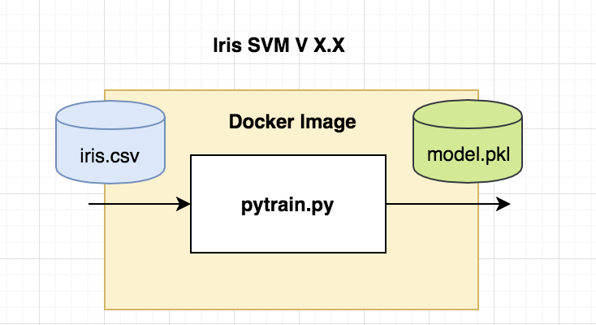
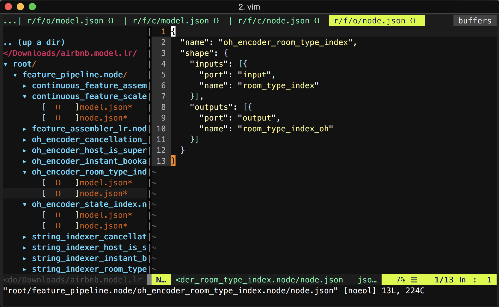
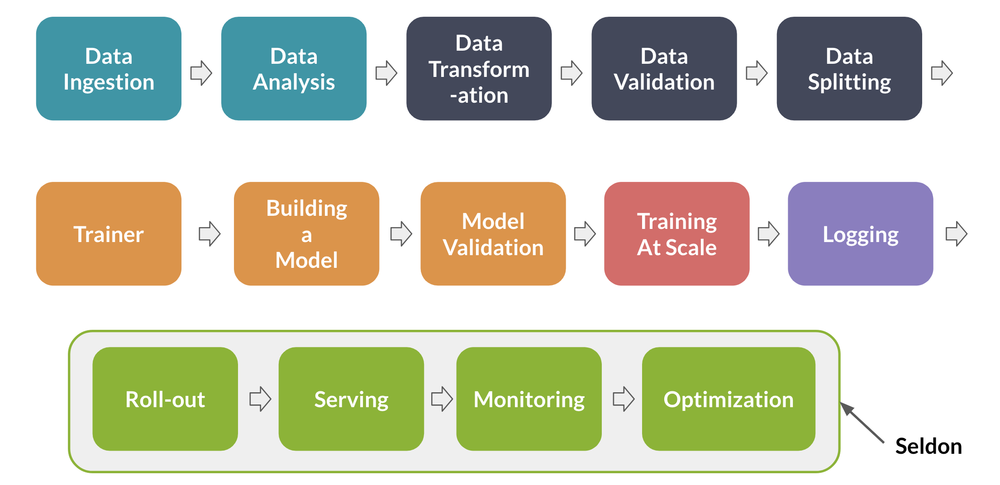
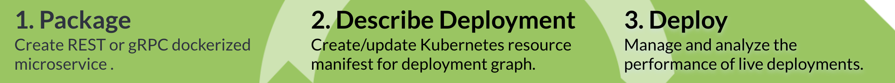
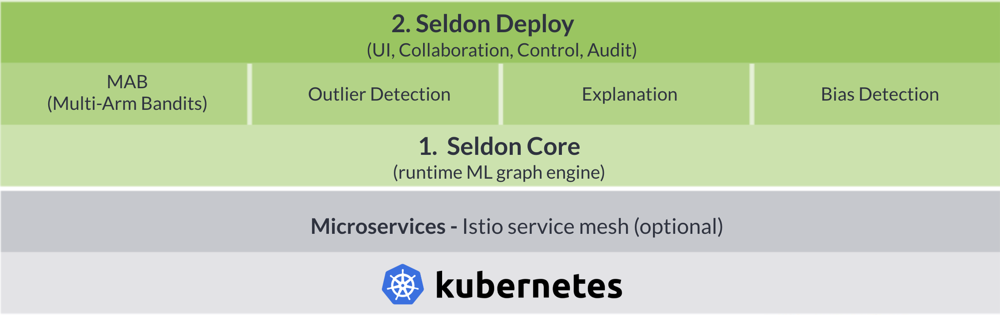
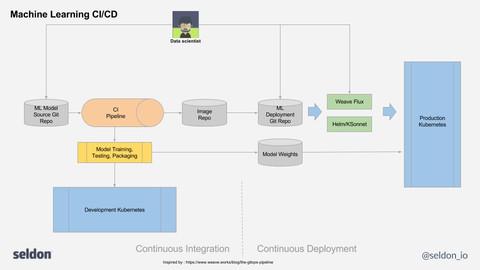
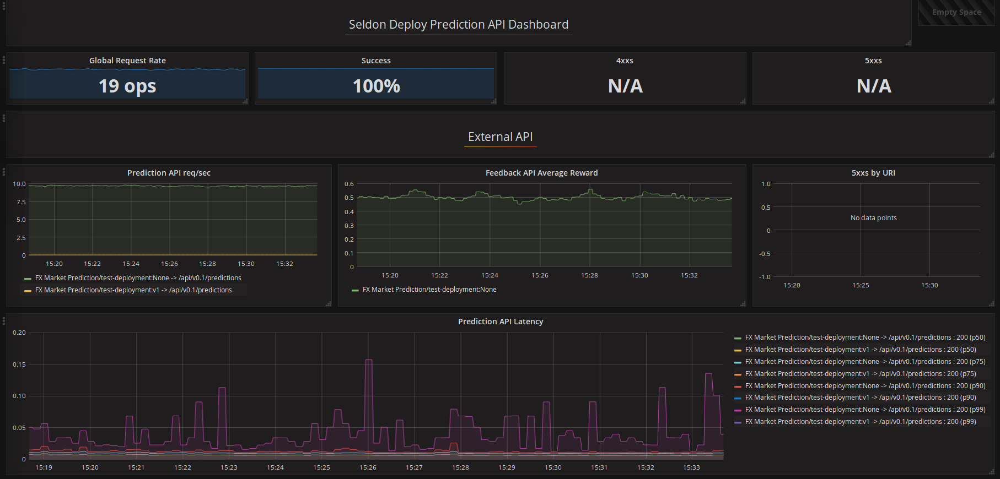

<!-- .slide: data-background="images/network-background.jpg" class="background" -->

<h2>Scalable Data Science</h2>
<h4>The state of DataOps / MLOps operations in 2018</h4>
<p>
  <br />
  <br />
    Alejandro Saucedo <br/><br/>
    <a href="http://twitter.com/AxSaucedo">@AxSaucedo</a><br/>
    <a href="http://linkedin.com/in/AxSaucedo">in/axsaucedo</a><br/>
  <br />
</p>
<p>

[NEXT]
<!-- .slide: data-background="images/network-background.jpg" class="background" -->

<h2>Scalable Data Science</h2>
<h4>The state of DataOps / MLOps in 2018</h4>

<table class="bio-table">
  <tr>
    <td style="float: left">
        
        <br>
        <font style="font-weight: bold; color: white">Alejandro Saucedo</font>
        <br>
        <br>
    </td>
    <td style="float: left; color: white; font-size: 0.7em;">

        Head of Solutions Engineering
        <br>
        <a style="color: cyan" href="http://e-x.io">Eigen Technologies</a
        <br>
        <br>
        <br>
        Chairman
        <br>
        <a style="color: cyan" href="http://ethical.institute">The Institute for Ethical AI & ML</a>
        <br>
        <br>
        Member, Broader AI Expert Group
        <br>
        <a style="color: cyan" href="#">European Commission</a>
        <br>
        <br>
        Advisory group
        <br>
        <a style="color: cyan" href="http://teensinai.com">TeensInAI</a>
        <br>

    </td>
  </tr>
  <tr>
  </tr>
</table>
  

[NEXT]
<!-- .slide: data-background="images/network-background.jpg" class="background smallquote" -->

# Eigen Technologies

> Building front-/back-office automation ML
> <br>
> <br>
> Using probabilistic models for text analysis
>
> Working in Finance, Legal and Insurance
>
> Recently raised $17.5m to expand operations

### PS. We are hiring -> <a href="http://eigentech.com">eigentech.com</a>

    
[NEXT]
<!-- .slide: data-background="images/network-background.jpg" class="background smallquote" -->

## Scalable Data Science

> Motivations
> <br>
> <br>
> Concepts
> <br>
> <br>
> Existing Tools

####  Slides at: <a style="color: cyan" href="#">bit.ly/scalable-data-science</a>

[NEXT]
## #LetsDoThis

[NEXT SECTION]
# 1. Motivations

[NEXT]
Data science generalised in two workflows

* Model Development
* Model Serving


[NEXT]

If we have a small team of data scientists...
## We face a smaller number of issues

[NEXT]

* Small number of models to maintain
* Data scientists have knowledge of models in their head
* They each have their methods for tracking their progress

<br>
### It all works relatively well!


[NEXT]

# However
As our data science requirements grow...
## We face new issues

[NEXT]
#### Increasing complexity in flow of data
<div class="left-col">
    <ul>
        <li>Large number of data processing workflows</li>
        <li>Data is modified without stardardised trace</li>
        <li>Managing complexity of flows and scheduling becomes unmanagable</li>
    </ul>
</div>
<div class="right-col">

</div>

[NEXT]
#### Each data scientist has their own set of tools

<div class="left-col">
    <ul>
        <li>Some ♥ Tensorflow</li>
        <li>Some ♥ R</li>
        <li>Some ♥ Spark</li>
    </ul>
</div>
<div class="right-col">

</div>

<br style="clear:both">
### Some ♥ all of them


[NEXT]

#### Serving models becomes increasinly harder

<div class="left-col">

</div>
<div class="right-col">
    <ul>
        <li>Different model versions running in different environments</li>
        <li>Deploying and reverting models gets increasingly complex</li>
    </ul>
</div>

[NEXT]
#### When stuff goes wrong it's hard to trace back

<div class="left-col">

</div>

<div class="right-col">
    <ul>
        <li>Data scientists say it's a bug in the pipelines</li>
        <li>Data engineers say it's something wrong in the models</li>
        <li>Becomes a cat-and-mouse game</li>
    </ul>
</div>

[NEXT]


# Luckily for us
Many fellow colleagues have faced these issues for a while

and an active problem that many people are trying to address


[NEXT]

#### Data Scientists 
In charge of development of models
<br>
<br>

#### Data Engineers 
In charge of development of data pipelines
<br>
<br>

### DevOps / DataOps / MLOps Engineers
In charge of productionisation of models, data pipelines & products

[NEXT]

Let's get a deeper understanding


[NEXT SECTION]

# 2. Concepts 

[NEXT]

### As your technical functions grow...


[NEXT]

### So should your infrastructure


[NEXT]

### The 2 principles of ML-Ops
* Reproducibility
* Orchestration


[NEXT]

Let's break down the two general principles

[NEXT]

# Principle I
## Model & Data Versioning


The age-old question of reproducibility in data science

[NEXT]

### Dissecting each step in our pipelines


Each stage has code/config, as well as specific data in/out 

[NEXT]

## Abstracting individual steps


<div style="float: left; width: 33%">
<h4>Data in </h4>

<pre><code class="code python hljs" style="font-size: 0.6em; line-height: 1em">
$ cat data-input.csv

>            Date    Open    High     Low   Close     Market Cap
> 1608 2013-04-28  135.30  135.98  132.10  134.21  1,500,520,000
> 1607 2013-04-29  134.44  147.49  134.00  144.54  1,491,160,000
> 1606 2013-04-30  144.00  146.93  134.05  139.00  1,597,780,000

</code></pre>
</div>

<div style="float: left; width: 33%">
<h4>Code / Config</h4>
<pre><code class="code python hljs" style="font-size: 0.6em; line-height: 1em">
$ cat feature-extractor.py

> def open_norm_feature_extractor(df):
>     feature = some_lib.get_open(df)
>     return feature


</code></pre>
</div>

<div style="float: left; width: 33%">
<h4>Data out</h4>
<pre><code class="code python hljs" style="font-size: 0.6em; line-height: 1em">
$ cat data-output.csv

>   Open 
>   0.57 
>   0.59 
>   0.47 

</code></pre>
</div>


[NEXT]

<div style="position: absolute; width: 30%; left: -22%; top: -5%">

</div>
## Going one level higher

We can abstract our entire pipeline and data flows


_note_
Similarly we can store the accuracy of the model
Together with all the parameters that were used to compute it


[NEXT]

This gets us closer to our ultimate objective:

# Reproducibility

[NEXT]

## Reproducibility enables for
* Traceablility when debugging for errors
* Transparency on the steps that lead to results
* Modularity of components so they can be reused
* Abstraction to support multiple libraries 
* Robustness if we need to go back to a previous release

[NEXT]

Once we have our internal representations for our models...

### We are able to serve them in production

[NEXT]

# Principle II 
### Model Deployment Orchestration


Covers complexities of serving models in production

[NEXT]

#### Similar to CI / CD / Monitoring for software...

# But completely different

_note_
And it's different because we are not dealing with 
"just software"...

[NEXT]

### A. Karpathy on Software 2.0 (AKA ML)

1) We specify some goal on the behavior of a desirable program (instead of coding it)
```
(e.g., “satisfy a dataset of input-output pairs of examples,” 
or, “win a game of Go”)
```
2) write a rough skeleton of the code
```
(e.g., a neural net architecture) that identifies a 
subset of program space to search, 
```
3) use the computational resources at our disposal to search this space for a program that works.

[NEXT]

Let's see how this differs

[NEXT]

# Monitoring 

### Going beyond debug logs

[NEXT]

# Monitoring 

<div class="left-col">
<h3>Short term</h3>

<ul>
    <li>Anomalies </li>
    <li>Bias</li>
    <li>Comp. vs prev model</li>
</ul>
</div>

<div class="right-col">
<h3>Long term</h3>
<ul>
    <li>Errors</li>
    <li>Outages</li>
    <li>Performance</li>
</ul>
</div>

<br style="clear:both">
<br style="clear:both">
### Ensuring short and medium term approaches

[NEXT]

#### Quality control processes in production are 
## necessary 
#### and need to be specific to its usecase

[NEXT]

# Compliance 

<ul>
    <li>What happened</li>
    <li>When it happened</li>
    <li>Why it happened</li>
    <li>How it happened</li>
</ul>

<br>
### A boring word with exciting benefints

[NEXT]

#### We Can stop praying to the demo gods

<div style="width: 40%; float: left">

</div>

<div style="width: 60%; float: left">
<a href="https://www.youtube.com/watch?v=eOzl-LFqYFM" style="font-size: 0.6em">Guidelines for and properties of compliant ML</a>

<a href="https://www.youtube.com/watch?v=eOzl-LFqYFM" style="font-size: 0.6em">CNCF 2018 - Pachyderm</a>
</div>
<br style="clear: both">


[NEXT]

This enables the data scientists, data engineers, and devops/mlops engineers to:
* Trace back issues
* Debug problems
* Report critical issues
</div>


[NEXT]

## Computational Resource allocation

Services with different computational requirements

With often complex computational graphs

We need to be able to allocate the right resources


[NEXT]

## This is a hard problem

It's basically an operating system kernel

where physical resources have to be abstracted

and the "software" can be:
* An ETL framework
* A HDFS-based service 
* A Kubernetes cluster
* Any distibuted framework!


[NEXT]

#### Resource allocation Makes a difference


Compare traditional server allocation

[source: <a href="https://algorithmia.com/">Algorithmia</a>]

[NEXT]

#### Resource allocation Makes a difference


To auto-scale 

[source: <a href="https://algorithmia.com/">Algorithmia</a>]

[NEXT]

#### Resource allocation Makes a difference


Even to serverless

[source: <a href="https://algorithmia.com/">Algorithmia</a>]


[NEXT]

So now we understand some of the implications

## What's next?

### Let's have a look at some solutions

[NEXT SECTION]

# 3. Existing Tools

[NEXT]

I'm putting together a list in Github on

# "Awesome MLOps"

with the tools available for ML Operations

## Feel free to chip in!

<br>
#### <a href="bit.ly/awesome-mlops">bit.ly/awesome-mlops</a>

[NEXT]

# Principle I 
## Reproducibility
Model and data versioning

[NEXT]

## PMML

A standard way of representing machine learning model pipelines for storage and serialisation

<iframe src="http://dmg.org/pmml/v4-1/GeneralStructure.html" frameborder="0" style="width: 100%; height: 40vh"></iframe>

Several systems use it to transfer models across platforms

[NEXT]
## PMML

#### Exporting to PMML using sklearn2pmml
```
from sklearn import datasets, tree
iris = datasets.load_iris()
clf = tree.DecisionTreeClassifier()
clf = clf.fit(iris.data, iris.target)

from sklearn_pandas import DataFrameMapper
default_mapper = DataFrameMapper(
    [(i, None) for i in iris.feature_names + ['Species']])

from sklearn2pmml import sklearn2pmml
sklearn2pmml(estimator=clf,
             mapper=default_mapper,
             pmml="D:/workspace/IrisClassificationTree.pmml")
```

[NEXT]

## Data Version Control (DVC)

A full-on Open-source Version Control System for Data Science Projects

<div class="left-col">
<br>
A fork of git, built by iterative.ai, that allows for grouping data, 
config and code through a version control system
</div>

<div class="right-col">

</div>


[NEXT]

## Data Version Control (DVC)

#### Add your data

```
dvc add images.zip
```

#### Connect data input, model output and code

```
dvc run -d images.zip -o model.p ./cnn.py
```

#### Add repository location (here is s3)

```
dvc remote add myrepo s3://mybucket
```

#### Push to the location specified

```
dvc push
```

[NEXT]

## ModelDB

A more implicit way of tracking the inputs, outputs and configurations on a library-level by extending the functions themselves. 

<div class="left-col">
<h4>Normal sklearn</h4>

<pre><code class="code python hljs" style="font-size: 1em; line-height: 1em">
def fit_and_predict(data):
    model.fit(data)
    preprocessor.transform(data)
    model.predict(data)

</code></pre>
</div>


<div class="right-col">
<h4>ModelDB-enabled</h4>

<pre><code class="code python hljs" style="font-size: 1em; line-height: 1em">
def fit_and_predict(data):
    model.fit_sync(data)
    preprocessor.transform_sync(data)
    model.predict_sync(data)

</code></pre>
</div>

This basically stores all the steps that were used, together with the results and predictions of the model


[NEXT]

## ModelDB

This allows for exploration of models that have been run

<!--<iframe src="http://modeldb.csail.mit.edu:3000/projects/1/models" frameborder="0" style="width: 100%; height: 50vh"></iframe>-->
<iframe src="https://mitdbg.github.io/modeldb/" frameborder="0" style="width: 100%; height: 50vh"></iframe>

[NEXT]

# Pachyderm 


Pachyderm is an end-to-end model-versioning framework that allows for reproducible pipeline definitions.

[NEXT]

## Pachyderm

Pachyderm consists of three main components:
* Data "repositories"
* Processing steps wrapped in docker containers
* Pipelines that connect steps and data repositories

<br>
#### Each step contains an input and output of data

[NEXT]

## Pachyderm Example

Building a training pipeline for iris classifier

Using sklearn svm, output a training model


[NEXT]

## Create a repo and add data

Create a repo
```
$ pachctl create-repo training
$ pachctl list-repo
NAME                CREATED             SIZE
training            2 minutes ago       0 B
```

Commit data (with -c flag) into the repository
```
$ pachctl put-file training master -c -f data/iris.csv
```

[NEXT]

## Build your docker image


<div class="left-col">
<h4>pytrain.py</h4>

<pre><code class="code python hljs" style="font-size: 0.6em; line-height: 1em"># pytrain.py

...import dependencies
 
cols = [ "Sepal_Length", "Sepal_Width", "Petal_Length", "Petal_Width", "Species" ]
features = [ "Sepal_Length", "Sepal_Width", "Petal_Length", "Petal_Width" ]

# Load training data
irisDF = pd.read_csv(os.path.join("/pfs/training", 
    "iris.csv"), names=cols)

svc = svm.SVC(kernel='linear', C=1.0).fit(
    irisDF[features], irisDF["Species"])

# Save model to pachyderm /pfs/out
joblib.dump(svc, os.path.join("/pfs/out", 'model.pkl'))

</code></pre>
</div>


<div class="right-col">
<h4>Dockerfile</h4>

<pre><code class="code python hljs" style="font-size: 1em; line-height: 1em">
FROM ubuntu:14.04

...install dependencies 

# Add our own code.
WORKDIR /code
ADD pytrain.py /code/pytrain.py


</code></pre>
</div>

[NEXT]

## Define computational pipeline

```
{
  "pipeline": {
    "name": "model"
  },
  "transform": {
    "image": "pachyderm/iris-train:python-svm",
    "cmd": ["python3", "/code/pytrain.py",]
  },
  "input": {
    "atom": {
      "repo": "training",
      "glob": "/"
    }
  }
}
```

[NEXT]

## Reproducible pipeline



# Now what?


[NEXT]

# Principle II
## Orchestration
Model Deployment Orchestration

[NEXT]

## MLeap

Diving one level deeper into serialization of models

<div class="left-col">

</div>
<div class="right-col">
<br>
MLeap is used in open source projects that look to abstract the serialisation, execution of various machine learning libraries.
</div>

[NEXT]

## MLeap Serving
Run the server
```
$ docker run \ 
    -p 65327:65327 \
    -v /tmp/models:/models \
    combustml/mleap-serving:0.9.0
```
Load a model
```
curl -XPUT -H "content-type: application/json" \
  -d '{"path":"/models/<my model>.zip"}' \
  http://localhost:65327/model
```

[NEXT]

## MLeap Optimized bundles




[NEXT]

## Seldon-core



"Machine Learning Deployment for Enterprise"

[NEXT]


## Strong focus on model orchestration


[NEXT]

### Tackling the CI/CD challenge


[NEXT]

### Enabling monitoring with grafana


[NEXT]

# What about us?
### We built our infrastructure:
* Nightly accuracy monitoring framework
* Internal JSON standard for metadata model versioning
* Distributed manager-worker rabbitmq architecture
* Generalised abstraction layer above ML libraries
* SDK interface to extend pipelines 
* End to end data pipeline framework
* Internal machine learning data labelling tools

[NEXT]

# What about you?

[NEXT SECTION]
<!-- .slide: data-background="images/network-background.jpg" class="background smallest" -->

## Scalable Data Science
> Motivations
> <br>
> <br>
> Concepts
> <br>
> <br>
> Existing Tools

####  Slides at: <a style="color: cyan" href="#">bit.ly/awesome-mlops</a>


[NEXT]
<!-- .slide: data-background="images/network-background.jpg" class="background" -->
### Scalable Data Science
https://bit.ly/scalable-data-science

### Awesome MLOps List
http://bit.ly/awesome-mlops

[NEXT]
<!-- .slide: data-background="images/network-background.jpg" class="background" -->

<h2>Scalable Data Science</h2>
<h4>The state of DataOps / MLOps in 2018</h4>

<table class="bio-table">
  <tr>
    <td style="float: left">
        
        <br>
        <font style="font-weight: bold; color: white">Alejandro Saucedo</font>
        <br>
        <br>
    </td>
    <td style="float: left; color: white; font-size: 0.7em;">

        Head of Solutions Eng./Science
        <br>
        <a style="color: cyan" href="http://e-x.io">Eigen Technologies</a
        <br>
        <br>
        <br>
        Chairman
        <br>
        <a style="color: cyan" href="http://ethical.institute">The Institute for Ethical AI & ML</a>
        <br>
        <br>
        Member, Broader AI Expert Group
        <br>
        <a style="color: cyan" href="#">European Commission</a>
        <br>
        <br>
        Advisory group
        <br>
        <a style="color: cyan" href="http://teensinai.com">TeensInAI</a>
        <br>

    </td>
  </tr>
  <tr>
  </tr>
</table>
  


